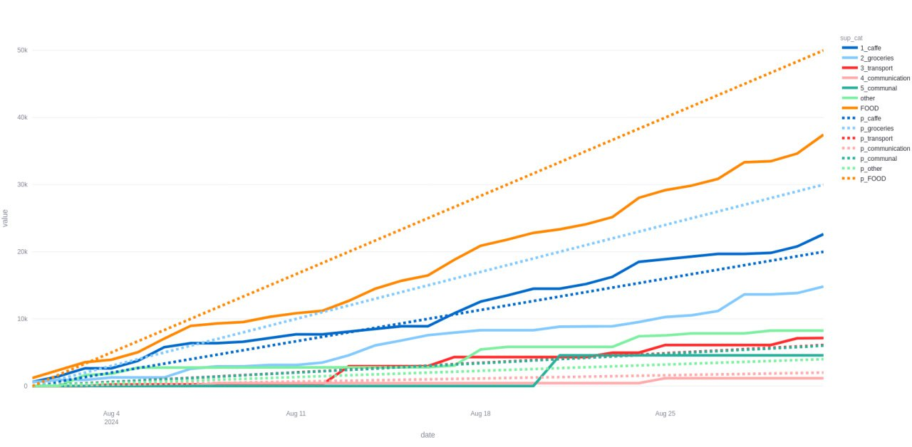
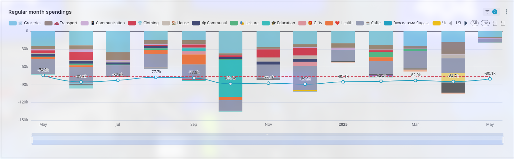

# MyMoney

MyMoney is a personal finance analytics tool for visualizing and analyzing your expenses. It supports importing bank transaction data, categorizing expenses, and displaying interactive charts.

The app is working with the data from T-Bank for now, but can be expandable.




## Features

- Import transactions from Excel or CSV files
- Categorize and group expenses
- Interactive dashboards with Streamlit and Plotly
- Planned vs actual expense tracking
- Database integration (MySQL, Directus)

## Superset Analytics

This project includes Superset chart configurations for advanced analytics and visualization.

- Superset YAML configs are located in [`superset_configs/`](superset_configs/).
- Example: `Regular_month_spendings_271.yaml` defines a mixed timeseries chart showing monthly spendings by category, with filters to exclude transfers, top-ups, and other non-expense categories.
- The chart uses:
  - **SUM(ammount)** metric, grouped by `category_fancy`
  - Monthly time grain (`P1M`)
  - Filters for negative amounts, excluded categories, and cards
  - Rolling 12-month average for comparison
  - Visual annotation for monthly spending limit

To use these configs:

1. Import the YAML file into Superset via _Settings → Import Chart_.
2. Make sure your Superset dataset matches the column names (`datetime`, `ammount`, `category_fancy`, etc.).
3. Adjust filters and metrics as needed for your data.

For more details, see the YAML files in [`superset_configs/`](superset_configs/)

## Getting Started

### Backend (Python)

1. Install dependencies:
   ```sh
   pip install streamlit pandas altair plotly mysql-connector-python python-dotenv
   ```
2. Run the Streamlit app:
   ```sh
   streamlit run main.py
   ```

## Configuration

- Expense categories: [`configs/mapCategories.json`](configs/mapCategories.json)
- Planned expenses: [`configs/plannedExpenses.json`](configs/plannedExpenses.json)
- Excluded categories: [`configs/excludedCategories.json`](configs/excludedCategories.json)

## Import to Directus

To sync transactions with Directus, configure `.env` and run:

```sh
python import_to_directus.py
```
